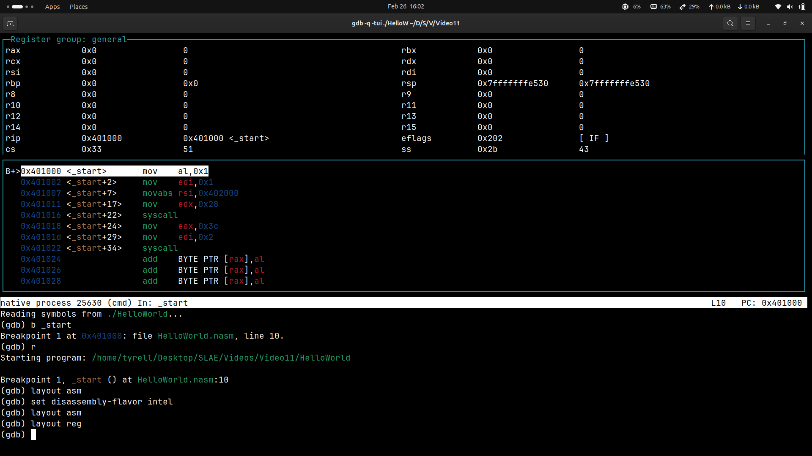
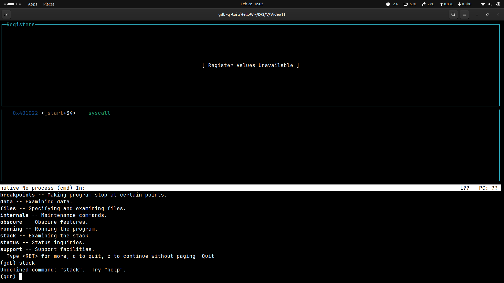

# **📌 GDB TUI Mode - Detailed Notes**

## **🟢 What is GDB TUI Mode?**
GDB's **Text User Interface (TUI)** mode provides a **graphical-like debugging interface in the terminal**. It helps visualize:
- **Source code**  
- **Assembly instructions**  
- **Registers and memory**  
- **Breakpoints and variables**  

---

## **🔹 1. Enabling TUI Mode**
You can enter TUI mode in **three** different ways:

### **1️⃣ Start GDB in TUI Mode Directly**
```bash
gdb -tui program_name
```
Example:
```bash
gdb -tui my_program
```

### **2️⃣ Enable TUI Mode Inside GDB**
If you're already in GDB:
```bash
(gdb) layout src
```
or
```bash
(gdb) tui enable
```

### **3️⃣ Start GDB with Arguments**
```bash
gdb -tui --args ./my_program arg1 arg2
```

---

## **🔹 2. Switching Between Layouts**
GDB TUI provides multiple **layouts** that you can switch between.

| **Command**     | **Description**                       |
|---------------|---------------------------------|
| `layout src`   | Show **source code** window      |
| `layout asm`   | Show **assembly** instructions  |
| `layout regs`  | Show **registers**              |
| `layout split` | Show **source + assembly**      |
| `layout next`  | Cycle through different layouts |
| `update`       | Refresh the display            |

💡 **Example**:
```bash
(gdb) layout asm
```
This switches the view to assembly instructions.

---

## **🔹 3. Changing Focus Between Windows**
When using TUI mode, you can **change focus** between different windows (source, registers, assembly) using:

| **Shortcut**           | **Action**                     |
|---------------------|--------------------------------|
| `Ctrl + X` → `O`   | **Cycle through TUI windows**  |
| `Ctrl + X` → `A`   | **Toggle TUI mode on/off**     |
| `Ctrl + X` → `1`   | Focus **source code window**   |
| `Ctrl + X` → `2`   | Focus **assembly window**      |
| `Ctrl + X` → `3`   | Focus **registers window**     |

💡 **Example**:  
Press `Ctrl + X`, then `O` to switch between different sections of TUI mode.

---

## **🔹 4. Navigating Inside Windows**
| **Shortcut**       | **Action**                              |
|----------------|----------------------------------|
| `Up/Down`       | Scroll source/assembly code     |
| `PgUp/PgDn`     | Scroll **faster**               |
| `Ctrl + L`      | Refresh display                 |
| `tui disable`   | Disable TUI and return to CLI  |

💡 **Example**:
Press `PgUp` or `PgDn` to scroll through the **source code window**.

---

## **🔹 5. Setting & Managing Breakpoints**
A **breakpoint** pauses execution at a specific point in the program.

```bash
(gdb) break main
```
or
```bash
(gdb) break 15   # Break at line 15
```

To **remove** a breakpoint:
```bash
(gdb) delete 1   # Removes breakpoint number 1
```

---

## **🔹 6. Running and Stepping Through Code**
| **Command** | **Description** |
|------------|-----------------|
| `run` / `r` | Start execution |
| `continue` / `c` | Resume after a breakpoint |
| `next` / `n` | Step to the next line (without entering functions) |
| `step` / `s` | Step **inside functions** |
| `finish` | Execute until the function returns |
| `until 20` | Run until **line 20** |

💡 **Example**:
```bash
(gdb) run
(gdb) next
```

---

## **🔹 7. Inspecting Variables**
| **Command**       | **Description**               |
|------------------|---------------------------|
| `print var`      | Print **value** of `var`  |
| `display var`    | Continuously show `var` in TUI |
| `info locals`    | Show all **local variables** |
| `info registers` | Show **CPU registers** |

💡 **Example**:
```bash
(gdb) print x
$1 = 10
(gdb) display x
```

---

## **🔹 8. Examining Memory**
| **Command**           | **Description**                 |
|----------------------|-----------------------------|
| `x/10xw 0xaddr`     | Examine memory at `0xaddr`  |
| `x/s var`           | View a string variable      |

💡 **Example**:
```bash
(gdb) x/10xw 0x555555554000
```
This prints **10 words** from memory at address `0x555555554000`.

---

## **🔹 9. Exiting GDB TUI Mode**
| **Command**    | **Description**           |
|--------------|-----------------------|
| `quit` / `q`  | Exit GDB             |
| `Ctrl + D`    | Exit GDB              |
| `tui disable` | Exit **TUI Mode only** |

💡 **Example**:
```bash
(gdb) quit
```

---

## **🔹 10. Full Example Debugging Session**
```bash
gdb -tui ./a.out
(gdb) break main
(gdb) run
(gdb) layout split
(gdb) next
(gdb) print x
(gdb) info registers
(gdb) continue
(gdb) quit
```

---

## **🔹 11. Example Output in TUI Mode**
```
[Source Code Window]
10   int main() {
11       int x = 5;
12       x = x + 10;  // Breakpoint here
13       return 0;
14   }

(gdb) print x
$1 = 5
```

---

---

---

### **🔥 Pro Tips**
✔️ Use `Ctrl + X` → `A` to **toggle TUI mode**.  
✔️ `layout split` is useful to see **both source and assembly**.  
✔️ Use `display var` to **track** variable changes during execution.  
✔️ `info registers` helps in **exploit development**.  


